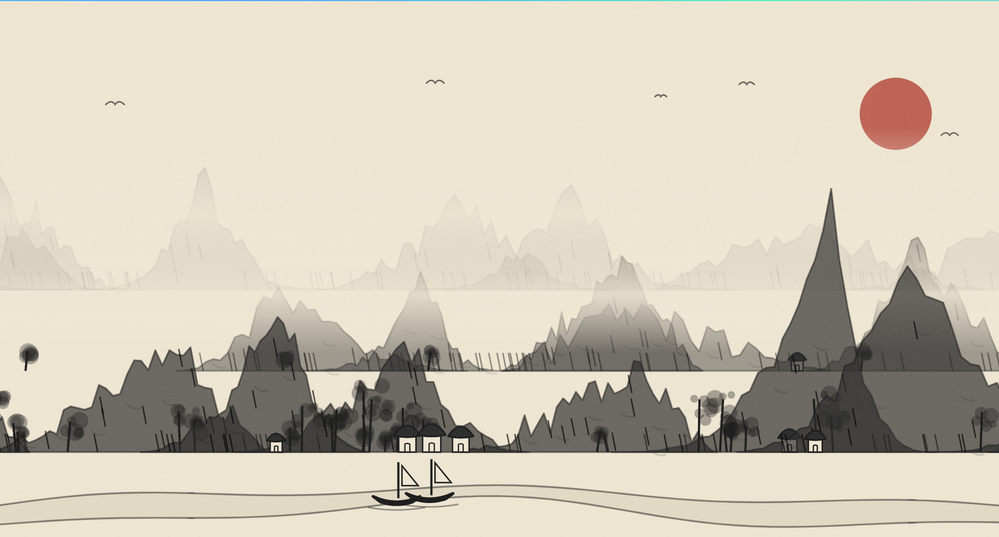

# MistBound Landscape

A single-file, infinite Chinese ink-wash landscape generator built with plain HTML, JavaScript, and SVG. It has no libraries, build tools, or dependencies.


## Run it

Open `index.html` in a modern web browser. You can also serve the folder with any basic local web server if you prefer.

## Controls

- **Right Arrow**: move the camera to the right.
- **Left Arrow**: move the camera to the left.
- **N**: generate a new random world seed.

The landscape also drifts slowly on its own. Mouse and touch dragging are not implemented yet.

## Choose a world seed

Add a positive integer seed to the URL to generate a repeatable world:

```text
index.html?seed=12345
```

Opening the same URL again generates the same terrain and details. Pressing **N** chooses a new seed and updates the URL. Without a valid seed parameter, the generator uses its default seed.

## How it works

- The landscape is drawn as SVG in chunks, each 400 units wide. Only chunks near the camera are generated.
- Each chunk gets its own deterministic random sequence, so chunks can be generated in any order.
- Mountains, trees, houses, birds, and boats use seeded randomness. The river and bridges use formulas based on world position so they line up across chunk boundaries.
- SVG groups control the draw order for the sky, distant birds, mountain layers, mist, river, foreground, and paper grain.
- The day/night cycle follows camera position; it changes the colors and sun/moon visibility without regenerating the terrain.

## Project structure

```text
index.html   Complete application: styles, SVG scene, and JavaScript generator
README.md    Project overview and usage instructions
```
